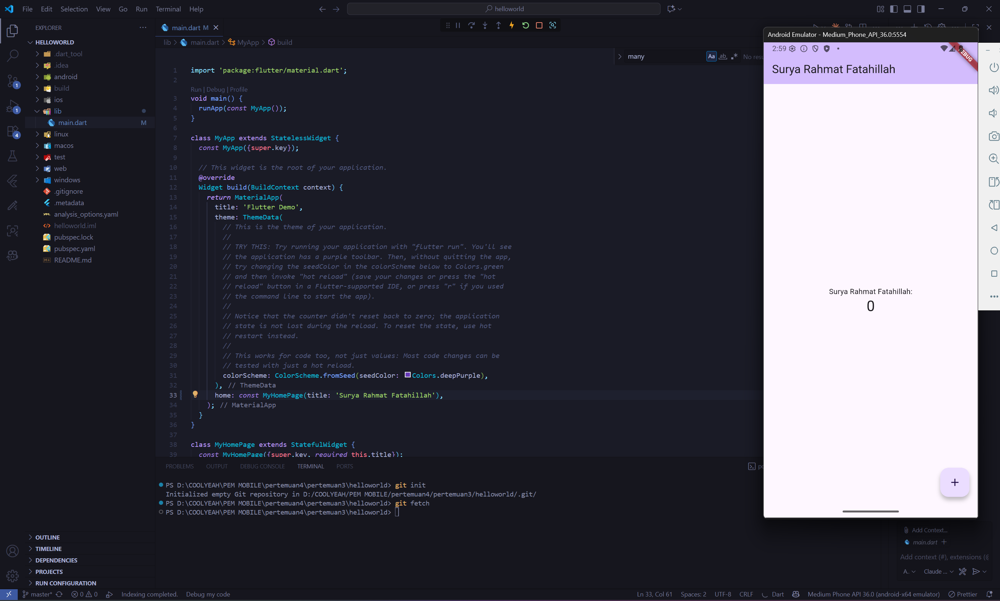
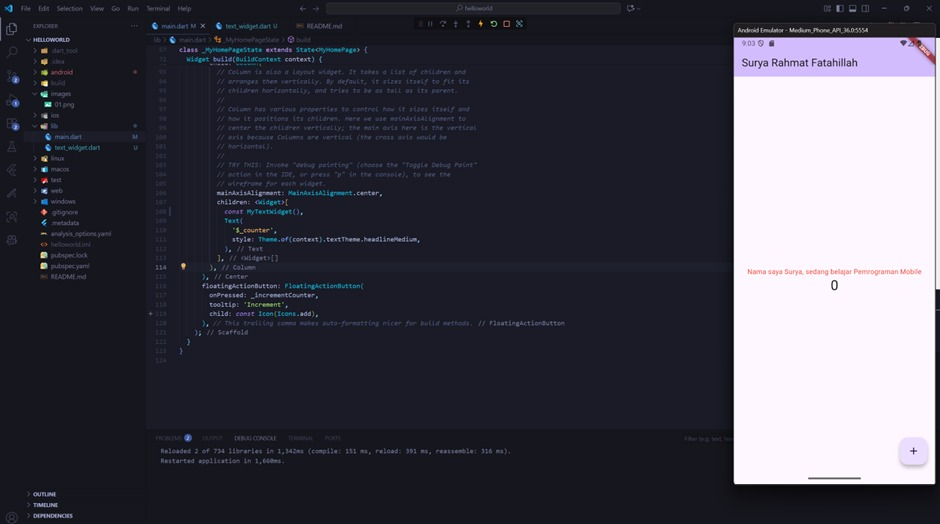

# Hello World - Flutter Fundamental Part 1

Proyek Flutter untuk mempelajari konsep dasar pengembangan aplikasi mobile dengan Flutter.

## Deskripsi Project

Project ini merupakan bagian dari pembelajaran Flutter fundamental yang mencakup berbagai konsep dasar seperti widget, layout, styling, dan komponen UI dasar dalam Flutter.

## Progress Development

### 1. Setup Awal Project

Tahap awal pembuatan project Flutter dengan struktur dasar aplikasi. Menampilkan setup initial project dengan Material Design dan scaffold dasar.

### 2. Basic Widget Implementation

Implementasi widget dasar seperti **Text**, **Container**, dan layout sederhana dengan **Column** dan **Row**. Fokus tahap ini adalah memahami struktur widget tree.

### 3. Image Widget Customization

Pengembangan **Image Widget** dengan menampilkan logo Polinema yang diambil dari folder `assets/`. Kustomisasi dilakukan dengan pengaturan ukuran, fit, dan posisi gambar.

### 4. Text Widget

Penggunaan **Text Widget** dengan berbagai properti styling seperti `fontSize`, `color`, `fontWeight`, dan `textAlign` untuk menampilkan teks yang lebih variatif dan terformat.

### 5. Cupertino Button dan Loading Bar

Implementasi **CupertinoButton** untuk gaya tombol ala iOS, serta penggunaan **CircularProgressIndicator** sebagai loading bar untuk memberikan umpan balik visual pada user.

### 6. Floating Action Button (FAB)

Penggunaan **FloatingActionButton** (FAB) yang ditempatkan sesuai prinsip Material Design. FAB biasanya digunakan untuk aksi utama dalam sebuah halaman aplikasi.

### 7. Scaffold Widget

Penerapan **Scaffold Widget** untuk membuat struktur dasar halaman seperti `AppBar`, `Drawer`, `BottomNavigationBar`, `FloatingActionButton`, dan body content.

### 8. Alert Button

Implementasi **AlertDialog** yang muncul ketika sebuah tombol ditekan. Dialog menampilkan pesan dan pilihan aksi yang dapat dipilih oleh pengguna.

### 9. Text Field

Penggunaan **TextField** untuk menerima input dari user. Termasuk kustomisasi placeholder (`decoration`), `keyboardType`, dan `obscureText` untuk input password.

### 10. Date Picker

Integrasi **DatePicker** untuk memilih tanggal, bulan, dan tahun di dalam aplikasi. User dapat memilih tanggal dengan tampilan kalender interaktif.

## Komponen yang Dipelajari

* ✅ **Text Widget**: Styling dan formatting text
* ✅ **Image Widget**: Menampilkan gambar dari assets
* ✅ **Container**: Layout dan decoration
* ✅ **Column & Row**: Pengaturan layout
* ✅ **Button Widgets**: Material & Cupertino button
* ✅ **Loading Indicators**: UI feedback
* ✅ **Floating Action Button**: Primary actions
* ✅ **Scaffold Widget**: Struktur halaman aplikasi
* ✅ **AlertDialog**: Dialog interaktif
* ✅ **TextField**: Input teks dari user
* ✅ **DatePicker**: Pemilihan tanggal
* ✅ **Material Design**: Implementasi design system

## Cara Menjalankan

1. Pastikan Flutter SDK sudah terinstall
2. Clone repository ini
3. Jalankan `flutter pub get` untuk install dependencies
4. Jalankan `flutter run` untuk menjalankan aplikasi

## Assets

Project ini menggunakan beberapa assets:

* `assets/logoPolinema.png` - Logo Politeknik Negeri Malang
* Berbagai image assets untuk dokumentasi progress

## Author

Dibuat sebagai bagian dari pembelajaran **Flutter Fundamental Part 1**
Oleh **Surya Rahmat Fatahillah**
NIM **2341760020**